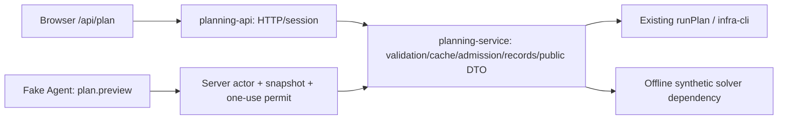

# M4 — Compute-only planning preview

M4 adds one `compute` capability, `plan.preview`, alongside the unchanged four M0 read tools. It is a candidate preview, never a write Agent. This local engineering phase supports **fake Agent + server-owned synthetic inputs + mocked solver boundary** only. Real Workspace/Box execution and external-model preview processing are not released.

## Audited planning chain and shared boundary

Before extraction, `src/api.ts:computePlan` serialized the browser request and cancellation signal to `/api/plan`. The route combined HTTP checks, sample/session resolution, input validation, cache ownership and solver orchestration. The queue-enabled configuration permits only trusted sample input on this synchronous endpoint; personal calculation uses the existing task API/worker. That routing constraint remains.

| Responsibility | Final owner and behavior |
| --- | --- |
| HTTP | `/api/plan` delegates to `planning-api.ts`: Request/Response, same-origin, 2 MiB body limit, session resolution, request ID, IP extraction, optional Skland owner-tag resolution, public error envelope |
| Access | `planning-actor.ts` issues an opaque server-session actor; serialized/forged actors fail. `planningAccess` enforces the existing queued-deployment restriction before session work and again in the core |
| Input | `planning-service.ts` clones inputs; validates layout, operator entries, collection limits, supported rotation, Fiammetta compatibility and calculation context. Trusted sample Box is loaded server-side; personal input requires a session actor |
| Cache | Same solver-identity/HMAC key, cache lease, existing wait budget, normalized public result, run record, ownership reference, revocation and eviction mechanisms. Cache hit skips solver admission. Miss publication follows durable record/reference; fallback results are not cached |
| Admission | Same `acquirePlanSlot` / anonymous sample admission: account, IP, new-account and global concurrency/start limits. IP is injected from HTTP, never tool arguments |
| Solver | Shared core calls existing `runPlan`; CLI/protocol validation, serve lane, existing fallback policy, private artifacts and public projection remain in the existing infra layer |
| Timeout / cancellation | Existing solver timeout (default 180 s, deployment configurable) and matching cache lease are retained. Agent additionally waits at most 5 s/tool, 20 s/run. Cancellation is checked before execution, after awaited cache/solver work and before returning; a settled late result is discarded |
| Records / diagnostics | Existing run-record and cache writes are execution bookkeeping, not saved-plan/Workspace writes. Private CLI errors/artifacts stay behind `toPublicPlanData`; Agent reduces failures to stable codes and logs no model payload |

The synchronous infra API does not expose a per-run forced cancellation contract. The service **retains its admission slot until non-cooperative solver work settles**, even after the Agent stops waiting; it never frees capacity while an old computation is still active. Cache cancellation prevents subsequent solver invocation once an outstanding lookup settles. M4 adds no timeout retry or solver fallback loop. Existing infra fallback remains the normal page's internal implementation; the synthetic boundary does not invoke it. Real solver cancellation/performance are not claimed tested.



`createPlanningService` is the single business implementation. Production `/api/plan` uses its real dependencies. M4 local demo uses the same core with server-owned mock solver/sample/record dependencies; its cache identity is unavailable, so it takes the existing cache bypass path, and still shares real process admission. Tests separately exercise cache hit/lease/publication paths. No second solver orchestration or direct Tool→CLI/private client exists.

## Tool contract and authorization

Strict input, no additional keys:

```json
{"baseRevision":"m4-synthetic-v1","rotationProfile":"abc_12_6_6"}
```

`rotationProfile` is one of `main_backup_12_12`, `abc_12_6_6`, `abc_12_12_12`. No candidate arrays, arbitrary flags, CLI arguments, Box, Workspace blob, actor, userId or endpoint are accepted. Base revision comes from the server-owned version of the synthetic scenario. The browser's current context revision is only a correlation/stale value and is separately bound to the issued capability.

The normal Agent API still accepts only `{message, context}`, authenticates the website user, and classifies all HTTP inputs as business context for egress. After the server's existing fake-mode check, the synthetic preview resolver requires an exact current synthetic snapshot, active shift zero and no observed account schedule. It issues a process-local capability bound to that actor object, snapshot fingerprint, base revision, requested target and existing planning actor. The Registry checks visibility and execution again. A different actor, cloned capability, changed snapshot or wrong revision cannot use it.

Supported explicit local grammar:

- `preview abc_12_6_6`
- `如果把轮换改成 abc_12_6_6，试算一下。`

This deliberately narrow fake grammar is not general model-language understanding. Ordinary questions retain only the four M0 read tools. The loop checks the actual message against the capability's requested target; a model cannot substitute another rotation. An explicit preview request cannot be completed successfully without a successful compute result.

Budget: one preview attempt per issued Agent run, one candidate. The attempt is consumed before awaiting execution, including failure, cancellation and timeout. Existing repeated-call ID/argument checks, model-step/tool/token/result limits remain. No enumeration, automatic retry, save, pin or apply exists.

## Result and UI

The output is explicitly constructed from the shared service's public DTO and the bound baseline snapshot, then checked by `parsePreviewResult` on the client. It includes status, scenario assumptions, base/current revision, shift count and natural-24-hour LMD, deterministic current→preview differences, code-generated source, sampled/computed timestamps, cache-hit flag and stable issue/limitations. Missing or estimated production is not compared as solver production; failed/missing solver results have no summary or differences. No full public plan, Box, persistent plan IDs or private diagnostics enter the model observation.

Every result carries `PREVIEW_ONLY`, `NOT_SAVED`, `NOT_APPLIED`. The current synthetic solver fixtures use authored example numbers (100→120 LMD, not a quality claim). They demonstrate integration, not actual feasibility, production or optimality. Other changes/real workspaces are deliberately unsupported in this phase.

The existing Advisor Panel offers an explicit **synthetic example** checkbox affecting only the panel's request projection. It leaves the page's plan, layout, Box, saved plans and Workspace untouched. It shows assumptions, computing, success/failure, a comparison table, revisions, source, timestamps and solver limitations. Question/context/account/active-shift changes invalidate old results. Stop/close/unmount abort the request and ignore late responses. No automatic page-result replacement or client storage write is added.

## Egress and no-write boundary

MoMA processing evidence remains UNKNOWN; `PROVIDER_RELEASE_STATUS=BLOCKED_UNVERIFIED_PROCESSING` and `REAL_BUSINESS_EGRESS_RELEASE=BLOCKED_PROVIDER_POLICY`. No Profile/Consent/Privacy/kill-switch bypass or release change occurs. M4 capabilities are removed for every external provider, even synthetic external test calls; a future provider approval alone will not enable preview egress. A future expansion must classify the new tool output under the versioned M3.6 payload policy first; the current external observation whitelist rejects `plan.preview`.

Consent remains policy state, not a model tool. No `save_plan`, `apply_plan`, `workspace.patch`, saved-plan insertion, business database write, RAG, memory, multi-agent or M6 approval flow was added. Run-scoped capabilities and the pre-existing cache/diagnostic mechanisms are not conversation memory.

## Offline evidence and limits

Tests in `planning-service.test.ts` and `planning-preview.test.ts` exercise HTTP→shared core and Agent→shared core, opaque actors, cross-user/stale rejection, narrow schema, cache ownership/publication, retained admission after cancel, no subsequent computation, one-attempt budgets, missing/failed solver, public result minimization and no snapshot mutation. Golden adds explicit English/Chinese preview and forbidden-operation cases. Agent E2E adds running/success/failure/cancel/stale/late-close flows and checks client storage remains unchanged.

Final executed gate counts and artifact results are recorded in [implementation status](implementation-status.md). Browser E2E mocks HTTP; separate API/Tool/service tests cover actual backend integration. No production database, private solver executable or external model was used for M4 acceptance. Deployment remains gated by provider processing approval and the earlier unexecuted real PostgreSQL migration validation.

## Final checkpoint review — 2026-09-09

The existing candidate was reviewed without redesign. HIGH 0, MEDIUM 0. One LOW coverage finding was closed: M4 failure/repeated-compute behavior existed in integration tests but lacked explicit Golden cases. Added ordinary-question-with-permit, solver-failure and second-attempt Golden checks; strengthened saved-plan metadata invariance and normal HTTP validation/failure/cache-input regression tests. No runtime repair was necessary. The initial new test fixture had an incorrect assumption about the default Fiammetta setting and an unvalidated `unknown` Box type; explicit test input and the existing parser corrected both before final gates.

| Review | Evidence and conclusion |
| --- | --- |
| R1 / R14 shared service and normal page | HTTP handler and Tool both execute `createPlanningService`; normal HTTP tests exercise actual validation, session identity, origin, body limit, solver failure/public envelope and cache dimensions. Route delegates without a second orchestration. Existing page default rotation/Fiammetta, admission and cache tests remain in full check |
| R2 / R3 / R11 tool and authorization | Exact two-field schema; server-issued actor/permit, snapshot fingerprint and requested target bind execution. No CLI flags, arbitrary context, identity, candidate list or generic patch. Prompt instructions are supplementary to deterministic checks |
| R4 no business writes | Snapshot and saved-plan metadata are equal before/after preview; browser local storage is unchanged. Execution dependencies expose no Workspace/save/pin/apply operation. Existing run/cache bookkeeping remains separate |
| R5 budget and cancellation | One consumed attempt; repeated call stops the loop; no timeout retry. Tests check abort before/during compute, no later solver start and admission retained while non-cooperative work settles. Real solver timeout/cancellation remain unvalidated |
| R6 cache | Core forwards validated layout, Box, source/name, rotation, Fiammetta and solver identity to the existing HMAC cache. Existing key tests vary every solver-affecting dimension. Page revision is a stale/correlation marker, not an extra solver input; same effective input may reuse cache. Preview mock has no solver cache identity and cannot hit page cache. Private IDs/diagnostics are absent from preview output |
| R7 / R8 result and source | Public projection, code-computed differences, null for missing/noncomparable LMD, strict parser and explicit synthetic source. Failed/missing compute cannot be reported as successful. PREVIEW_ONLY / NOT_SAVED / NOT_APPLIED remain mandatory |
| R9 / R12 egress and fixture isolation | Production rejects fake mode; browser cannot select it. Fixture IDs do not authorize actors. Synthetic resolver is reached only after session and server fake gate; external Loop removes preview capability. No Provider/Profile/Consent/payload/kill-switch change |
| R10 UI | Version tracks plan/layout/shift/observed/account changes; room questions are message input, not a separate authoritative room selection. Question mismatch hides old output. Stop/close/unmount ignore late responses; synthetic selection changes only panel context. Browser tests are mocked UI evidence |
| R13 PostgreSQL | M4 adds no migration. `NOT_VALIDATED_ON_REAL_POSTGRES` refers to M3.6 Consent migration 0016/persistence and the existing test-environment gap; no production database was accessed |

Final executions: shared service 9/9, preview 11/11, Agent 280/280, Golden 34/34, API contract 76/76, TypeScript, i18n/legal, full check and diff PASS. Build/browser results and checkpoint publication are recorded in [implementation status](implementation-status.md). No real solver or real model validation is claimed; provider processing remains unverified and real business egress remains blocked.

The M3.6 audit-only checkpoint is `8c35241d6391ab586beea519d61339fc19f0f4f2`. M4 Commit/Push are authorized for this final checkpoint after all required gates pass; deployment is not authorized. After checkpoint publication, stop. Suggested future work only: a separate real-solver/test-environment integration acceptance, Provider evidence completion, and then an explicit decision about M5/M6. None is started by this checkpoint.
